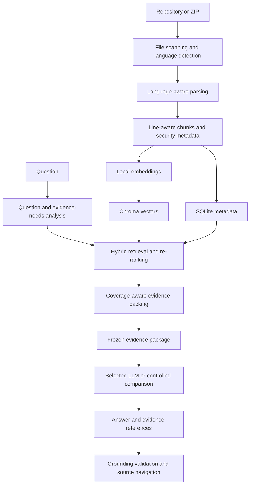

# SecurityCodeWiki

SecurityCodeWiki is an evidence-first repository security comprehension system. It imports source repositories, builds a searchable source index, and helps developers and auditors understand access-control behavior with answers tied to files, symbols, and line ranges.

The project combines language-aware parsing, local embeddings, hybrid retrieval, structured evidence packing, and local or cloud language models. Generated Security Wikis provide orientation, while repository source remains the primary evidence used to verify answers.

## Key capabilities

- Parse Java and Go with Tree-sitter, Python with its AST, and supported web/configuration formats with structural or line-range fallbacks.
- Produce line-aware source chunks with symbol, route, security-tag, and file metadata.
- Use `BAAI/bge-small-en-v1.5` through `sentence-transformers`, with a deterministic hash fallback for development.
- Store semantic vectors in Chroma and application, run, evaluation, and usage metadata in SQLite.
- Combine dense retrieval with lexical, identifier, symbol, route, selected-file, and security signals.
- Plan evidence roles and reserve required evidence through coverage-aware packing.
- Trace controller/entry-point calls to directly resolved downstream implementations.
- Perform repository-wide concept existence checks without turning absence results into fake source files.
- Ask one model or compare several models against the same frozen logical evidence package.
- Distinguish evidence supplied to a model from evidence cited in its answer.
- Validate evidence references and retain package hashes for reproducible comparisons.
- Navigate from evidence cards to exact source ranges in the Monaco editor.
- Review History and provider token, latency, and cost telemetry.
- Use local Ollama models or optional OpenAI, Gemini, and Groq providers.

## Architecture



The main backend flow lives in `backend/app/services/project_service.py`, `parser.py`, `vector_index.py`, and `audit_service.py`. Provider adapters are in `llm.py`; API routes expose ingestion, discovery, Wiki, Ask, Compare, history, evaluation, export, and usage operations.

## Repository structure

```text
SecurityWiki/
├── backend/
│   ├── app/
│   │   ├── api/routes/       # FastAPI endpoints
│   │   ├── core/             # Environment settings and authentication helpers
│   │   ├── db/               # SQLite initialization, models, and API schemas
│   │   ├── services/         # Parsing, retrieval, providers, evaluation, and usage
│   │   └── main.py           # Backend entry point
│   ├── tests/                # Deterministic backend and retrieval regressions
│   ├── .env.example          # Safe environment template
│   └── requirements.txt      # Python dependencies
├── frontend/
│   ├── public/               # Committed static assets
│   ├── src/
│   │   ├── pages/            # Projects, login, and analysis workspace views
│   │   ├── services/         # Browser API client
│   │   └── main.tsx          # Frontend entry point
│   ├── e2e/                  # Playwright test source
│   ├── package.json          # npm scripts and dependencies
│   └── package-lock.json     # Reproducible npm dependency lock
├── .gitignore
└── README.md
```

`storage/` and `backend/storage/` are runtime directories for imported repositories, indexes, and databases. They are intentionally not committed. Generated test output, screenshots, status reports, and local engineering notes are also excluded; automated test source remains committed.

## Prerequisites

- Git.
- Python 3.11 or newer. The repository does not pin a single interpreter version; use a current supported CPython release.
- Node.js 18, 20, or 22+ (the installed Vite version declares `^18.0.0 || ^20.0.0 || >=22.0.0`).
- npm, using the committed `package-lock.json`.
- Optional: [Ollama](https://ollama.com/) for local language models.
- Optional: API accounts for OpenAI, Gemini, or Groq.

A GPU is not mandatory, but embedding generation and local LLM inference can be slow on CPU. Large local models may need substantial system RAM or GPU VRAM.

## Clean-machine installation

```bash
git clone <YOUR_GITHUB_REPOSITORY_URL>
cd SecurityWiki
```

Create the backend environment from the repository root.

Linux/macOS:

```bash
python -m venv .venv
source .venv/bin/activate
python -m pip install --upgrade pip
python -m pip install -r backend/requirements.txt
cp backend/.env.example backend/.env
```

Windows PowerShell:

```powershell
python -m venv .venv
.\.venv\Scripts\Activate.ps1
python -m pip install --upgrade pip
python -m pip install -r backend\requirements.txt
Copy-Item backend\.env.example backend\.env
```

Install the frontend with the existing npm lockfile:

```bash
cd frontend
npm ci
cd ..
```

## Environment configuration

Edit `backend/.env` after copying the template. Keep this file local.

Core settings:

| Variable | Required | Purpose | Safe example |
|---|---|---|---|
| `APP_SUPERUSER_USERNAME` | Yes | Local application login name | `admin` |
| `APP_SUPERUSER_PASSWORD` | Yes | Local application login password | `change_this_password` |
| `APP_SECRET_KEY` | Yes | Signs application authentication tokens | `replace_with_a_long_random_value` |
| `APP_CORS_ORIGINS` | Yes | Comma-separated allowed frontend origins | `http://127.0.0.1:5173` |
| `PROJECT_STORAGE_PATH` | No | Imported/cloned repository storage | `./storage/projects` |
| `CHROMA_DB_PATH` | No | Chroma persistence path | `./storage/chroma` |
| `SQLITE_DB_PATH` | No | SQLite application database | `./storage/security_codewiki.db` |
| `EXPORT_STORAGE_PATH` | No | Reserved export storage | `./storage/exports` |
| `EMBEDDING_PROVIDER` | No | Local embedding implementation | `sentence-transformers` |
| `EMBEDDING_MODEL` | No | Sentence-transformer model | `BAAI/bge-small-en-v1.5` |

Provider settings:

| Variable | Required | Purpose | Safe example |
|---|---|---|---|
| `OLLAMA_BASE_URL` | For Ollama | Local Ollama API | `http://localhost:11434` |
| `OLLAMA_DEFAULT_MODEL` | For Ollama | Default local model tag | `qwen3.5:9b` |
| `OPENAI_API_KEY` | For OpenAI | Server-side OpenAI credential | empty |
| `OPENAI_DEFAULT_MODEL` | No | OpenAI model ID | `gpt-4o-mini` |
| `GEMINI_API_KEY` | For Gemini | Server-side Gemini credential | empty |
| `GEMINI_DEFAULT_MODEL` | No | Gemini model; blank resolves to the configured fallback | empty |
| `GROQ_API_KEY` | For Groq | Server-side Groq credential | empty |
| `GROQ_BASE_URL` | No | Groq-compatible API endpoint | `https://api.groq.com/openai/v1` |
| `GROQ_DEFAULT_MODEL` | No | Default Groq model | `openai/gpt-oss-20b` |
| `GROQ_ACTIVE_MODELS` | No | Comma-separated enabled Groq models | `openai/gpt-oss-20b` |

The template also documents provider timeouts, Ollama generation settings, repository limits, Wiki context limits, retrieval package sizes, and frozen evaluation identifiers. Keep those values stable when runs need to be comparable.

The frontend development server proxies `/api` to `http://127.0.0.1:8000`. Set `BACKEND_PROXY_TARGET` when starting Vite if the backend uses a different address.

## Run the application

Start the backend from `backend/` so default relative storage paths are predictable:

```bash
cd backend
python -m uvicorn app.main:app --host 127.0.0.1 --port 8000 --reload
```

In a second terminal:

```bash
cd frontend
npm run dev
```

Open `http://127.0.0.1:5173` and log in with the credentials from `backend/.env`. Backend health is available at `GET http://127.0.0.1:8000/api/health`; model/provider readiness is available at `GET /api/models/health`.

## Local Ollama models

Install Ollama separately, start it, and pull only the models you intend to use:

```bash
ollama serve
ollama pull qwen3.5:9b
```

The application queries the configured Ollama endpoint and shows locally available models. `qwen3.5:9b` and `nemotron-3.5-lightning:latest` have been used in formal experiments, but neither model is universally required. Formal runs store effective model configuration so research settings can be distinguished from ordinary interactive use.

## Cloud providers

OpenAI, Gemini, and Groq are implemented as optional backend providers. Put credentials only in `backend/.env`; the browser health endpoint reports availability without returning keys. Provider model availability, pricing, and rate limits are controlled by those services and may change. An HTTP 429 means the provider has temporarily rejected the request because of a quota or rate limit.

When a cloud model is selected, retrieved repository evidence is sent to that provider. Use local Ollama when repository material must remain on the local machine, subject to the security of the local host and model installation.

## Runtime storage

- **Chroma** stores embeddings and vector-retrieval metadata.
- **SQLite** stores projects, files, chunks, generated Wikis, conversations, evaluations, formal runs, provider usage, and package metadata.
- **Project storage** contains cloned or extracted repositories being analyzed.

With the default configuration and a backend launched from `backend/`, these live below `backend/storage/`. Starting from another working directory changes how relative paths resolve. Runtime storage is excluded from Git because it may contain imported source, model inputs/outputs, credentials embedded in historical errors, and local research data.

Deleting runtime databases or indexes can remove local projects, history, evaluations, and retrieval state. Back up valuable research data before any reset. Use the application's rebuild-index operation when only a project index needs rebuilding.

## Typical workflow

1. Start the backend and frontend.
3. Optionally provide a repository subfolder for a focused import.
4. Wait for scanning, parsing, chunking, embedding, and indexing.
5. Use **Discover** to find security-relevant files and symbols.
6. Open source or select an analysis focus.
7. Generate a **Security Wiki** when supplementary orientation is useful.
8. Use **Ask** and inspect the primary evidence cards beside the answer.
9. Use **Compare** to evaluate supported models against one frozen package.
10. Review **History**, evaluation status, and **Usage & Cost** details.

## Ask, Compare, and reproducibility

**Ask** sends the retrieved evidence package to one selected model.

**Compare** freezes the ordered logical evidence package and sends the same package to each selected model. Package IDs and SHA-256 hashes make evidence equality auditable; provider failures do not silently change the evidence supplied to other models.

**Supplied evidence** is everything the backend gave the model. **Cited evidence** is the subset the model referenced in its answer. A model can receive sufficient evidence yet cite only part of it, so the two counts are intentionally separate.

Development and diagnostic runs remain distinct from runs explicitly marked for formal evaluation.

## Evidence model

- `[E#]` entries are primary source evidence with a chunk ID, file, symbol, and line range.
- `[X#]` entries are repository-wide existence-search metadata. They record the concept, indexed scope, search variants, hit counts, result, and limitations. They are not fabricated source files.
- Generated Security Wiki sections are supplementary context. They do not replace primary source evidence.

The backend validates model references against the supplied E/X namespaces and reports unsupported source, symbol, route, and reference claims without replacing the original model answer.

## Testing and build validation

Backend tests:

```bash
python -m pytest backend/tests -q -c backend/pytest.ini
```

Frontend production build (includes TypeScript project compilation):

```bash
cd frontend
npm ci
npm run build
```

Playwright end-to-end tests:

```bash
cd frontend
npx playwright install chromium
npm run test:e2e
```

Playwright starts the frontend development server. Tests that mock API calls do not require cloud credentials; live integration still requires the corresponding local services. Generated reports, screenshots, videos, and build output are ignored. Test source is intentionally committed because it verifies retrieval coverage, evidence namespaces, existence checks, call-target resolution, serialization, validation, package integrity, and frontend workflows.

There is no separate configured lint script. `npm run build` is the current TypeScript/static frontend validation command.

## Security and privacy

- Never commit `.env`, API credentials, private keys, provider tokens, or runtime databases.
- Change the example login password and secret key before exposing the service beyond local development.
- Rotate any credential that appears in a log, database, screenshot, export, or Git history.
- Imported repositories may contain confidential source code; protect project storage and backups accordingly.
- Chroma, SQLite, generated Wikis, answers, and evaluation records may contain source-derived material.
- Cloud providers receive retrieved evidence when selected. Review provider terms and organizational policy before use.
- Keep the backend bound to loopback unless authentication, secrets, CORS, transport security, and deployment controls have been reviewed.

## Thesis context

The evaluation suite uses fixed security-code questions covering endpoint/authority enumeration, JWT claim conversion, authentication versus authorization, controller-to-service tracing, negative permission reasoning, role/authority semantics, JWT creation and validation, stateless configuration, requirement-to-code traceability, request-level versus method-level security, and repository-wide existence grounding.

The methodology distinguishes system and model findings:

- Missing evidence required to answer a question is a retrieval/system defect.
- Sufficient supplied evidence followed by an incorrect answer is a model-performance finding.


## Known limitations

- Parser structure varies by language; fallback line-range parsing is less precise than AST or Tree-sitter parsing.
- Hash embeddings are a development fallback and are not equivalent to semantic embeddings.
- A repository-wide `not_found` result covers indexed source only, not generated code, runtime-only configuration, encrypted settings, external identity systems, or unindexed files.
- Dynamic dispatch, reflection, framework wiring, and ambiguous call targets can limit downstream trace resolution.
- Framework defaults are not the same as behavior directly evidenced in a repository.
- Cloud providers can be temporarily unavailable or rate-limited.
- Local model latency and answer quality depend on model choice and hardware.
- Import limits make selected subfolders more practical than very large monorepositories such as full AOSP.
- Empirical validation is based on a limited collection of repositories and curated scenarios.

## Troubleshooting

| Problem | Checks |
|---|---|
| Backend cannot import `app` | Start Uvicorn from `backend/`, or ensure that directory is on `PYTHONPATH`. |
| Python dependency error | Activate the virtual environment and rerun `python -m pip install -r backend/requirements.txt` from the root. |
| Frontend cannot reach backend | Confirm port `8000`, check `BACKEND_PROXY_TARGET`, and make sure `APP_CORS_ORIGINS` contains the frontend origin. |
| Ollama unavailable | Run `ollama serve`, check `OLLAMA_BASE_URL`, and confirm `ollama list` contains a selected model. |
| No local models appear | Pull a model and refresh provider health; model tags must match Ollama exactly. |
| Cloud provider unavailable | Confirm the corresponding API key and model ID in `backend/.env`; check the provider's service status. |
| HTTP 429 | Wait for the provider retry/quota window or use another configured provider. |
| Chroma or SQLite appears in an unexpected folder | Start the backend from `backend/` or use absolute storage paths. |
| Indexing stops early | Review repository file/chunk/size limits and the project status message. |
| `npm` dependency/build error | Use a supported Node version, remove only local `node_modules`, then rerun `npm ci`. |
| Playwright browser missing | Run `npx playwright install chromium` from `frontend/`. |

## License

This repository currently has no explicit license. Add one only after the project owner chooses the intended licensing terms.
